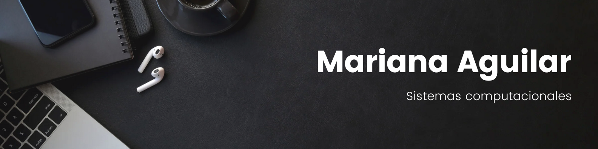

# Hola,soy Mariana Aguilar

Actualmente soy egresada de la carrera **Sistemas computacionales** 

Mi mayor satisfacción radica en **transformar ideas** en realidad a través del código, creando **soluciones** innovadoras y funcionales que mejoren la vida de las personas. Me emociona trabajar en proyectos que desafíen mis **habilidades** ✨ y me permitan aprender y crecer como profesional.
  
Además de mi experiencia en programación ❤, también tengo un gran interés en el diseño de prototipos de sitios front-end, me encanta trabajar en la creación de interfaces intuitivas y atractivas que proporcionen una experiencia de usuario excepcional. Desde el diseño de la estructura de la información hasta la implementación de diseños responsivos, disfruto cada paso del proceso de desarrollo.
  
Mi enfoque meticuloso y mi atención al detalle me permiten crear prototipos de alta calidad que cumplen con los estándares más exigentes. Estoy constantemente explorando nuevas técnicas y herramientas para mejorar mis habilidades y mantenerme al tanto de las últimas tendencias en diseño y desarrollo web.👌
  
Estoy emocionada por la oportunidad de colaborar en proyectos desafiantes que me permitan combinar mi pasión por la programación con mi habilidad para diseñar experiencias digitales cautivadoras y solucionar problemas de la vida cotidiana con la tecnología.😄

## 📝 Habilidades

+ Creativa
+ Trabajar en equipo
+ Resolver problemas

## Fortalezas

+ Perseverancia
+ Liderazgo
+ Versatil
+ Proactiva

## 🛠 Algunas herramientas que utilizo:

 

### Base de Datos

 

### Diseño

 

## Contactame por

&nbsp;

